  

  

 

我是一名后端工程师，专注 **Go / Java 分布式系统** 与 **AI 应用工程**。 
喜欢把复杂问题拆成清晰、可维护、可观测的系统，并把折腾出来的东西开源出去。 
主业之外常年在折腾自托管服务、家庭网络和开发工具链。

 

## 🚀 代表项目

**[dsh-commandcode-provider](https://github.com/Mars-Sea/dsh-commandcode-provider)** &nbsp;·&nbsp;   

> DeepSeek Harness 的 Command Code Provider 插件：接入 Command Code 模型、实时模型目录、按套餐选模型、推理强度、图像输入、联网搜索与多账号支持。
>  `TypeScript` · 已发布 npm 包 · 持续迭代中

**[doc-gen-service](https://github.com/Mars-Sea/doc-gen-service)** &nbsp;·&nbsp; 

> 基于 Spring Boot + poi-tl 的文档生成微服务，提供 REST 接口把结构化数据渲染成 Word / PDF 文档。
>  `Java` · `Spring Boot` · 模板化文档引擎

**[pot-app-translate-plugin-mtranserver](https://github.com/Mars-Sea/pot-app-translate-plugin-mtranserver)** &nbsp;·&nbsp; **[bergarust](https://github.com/Mars-Sea/pot-app-translate-plugin-bergarust)** &nbsp;·&nbsp; 

> 自托管翻译服务的 Pot-App 插件，让翻译不再受在线 API 的用量与速度限制。
>  `JavaScript` · 离线 / 自托管 · 隐私友好

**[dsh-deeppilot](https://github.com/Mars-Sea/dsh-deeppilot)** &nbsp;·&nbsp; **[base64-text-converter](https://github.com/Mars-Sea/base64-text-converter)** &nbsp;·&nbsp; **[esp8266-desk-display](https://github.com/Mars-Sea/esp8266-desk-display)**

> 一组小工具：iPhone 端 DSH 伴侣应用、纯前端 Base64 编解码器，以及基于 ESP8266 的桌面信息屏。
>  `Swift` / `TypeScript` / `C++` · 顺手造轮子系列

 

## 🛠 技术栈

**语言与后端**

  
  
  
  

**数据与中间件**

  
  
  
  

**工程与运维**

  
  
  
  

 

## 📊 GitHub 数据

  
  

 

  

